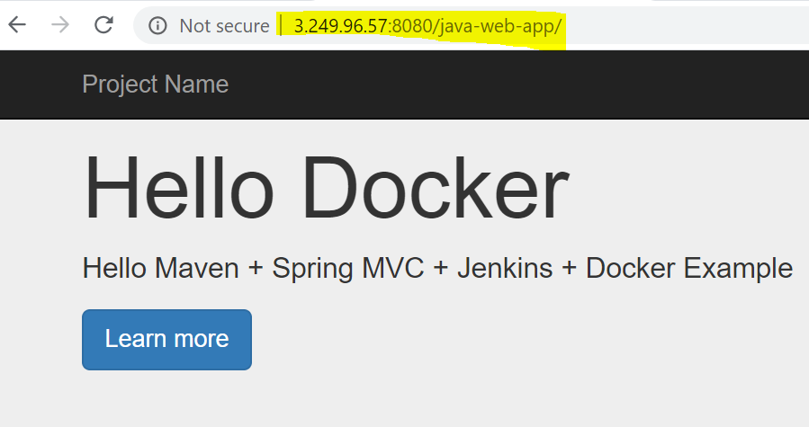
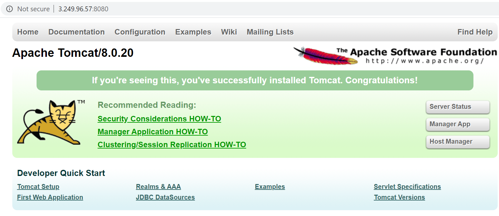

# Jenkins and Docker CI/CD pipeline

# Create two instances
 - 1. for CI/CD pipeline - Jenkins
 - 2. for Deployment server - Docker
# Step 1: install Jenkins, Docker in CI/CD server.

# Step 1.1: Install java openjdk-8
```
sudo apt update

sudo apt install openjdk-8-jdk -y
```

# Step 1.2: Install jenkins on Ubuntu 18

Create Ubuntu instance: This will be Deployment server.

We will server Doker, Java and Jenkins

- install Jenkins repo

```
wget -q -O - https://pkg.jenkins.io/debian/jenkins-ci.org.key | sudo apt-key add -

sudo sh -c 'echo deb http://pkg.jenkins.io/debian-stable binary/ > /etc/apt/sources.list.d/jenkins.list'
```
 - Updade
 ```
sudo apt-get update
sudo apt-get install jenkins
```

- enable service at bootstrap
```
systemctl status jenkins
```
- Get Jenkins PWD
```
cat /var/lib/jenkins/secrets/initialAdminPassword
```

# Step 1.3: Install Docker on Jenkins server
```
curl -fsSL get.docker.com | /bin/bash
sudo usermod -aG docker jenkins
sudo systemctl restart jenkins
```

# Step 2: Install Docker in Deployment server.

## Step 2.1 Install only Docker here:

```
sudo apt update
sudo apt install docker.io -y
sudo usermod -aG docker ubuntu
```

# Step 3: Create Jenkins Pipeline job to build and deploy docker image in Docker(Deployment) Server. 

## Step 3.1: Create a jenkins job Pipeline script

- add beloo to pipeline script
```
 node{
    stage("Git clone"){
        git url: 'https://github.com/MithunTechnologiesDevOps/java-web-app-docker.git', branch:'master'
    }
```
## Step 3.2: Maven clean package
- ``Add Maven >>Jenkins>>Manage jenkins>> global tool configuration >> add Maven version >> Copy the ID``

go to script add below stage:
```
 node{
    stage("Git clone"){
        git url: 'https://github.com/MithunTechnologiesDevOps/java-web-app-docker.git', branch:'master'
    }
    stage("Maven Clean Package){
        def mavenHome tool name: "Maven_3.6.3",type:"maven"
        sh "${mavenHome}/bin/mvn clean package"
    }
}

```
## Step 3.2: Docker image with code and neccessaary software. (tomcat, weblogic etc)
- add one more stage
```
 node{
    def buildNumber = BUILD_NUMBER
    stage("Git clone"){
        git url: 'https://github.com/MithunTechnologiesDevOps/java-web-app-docker.git', branch:'master'
    }
    stage("Maven Clean Package){
        def mavenHome tool name: "Maven_3.6.3",type:"maven"
        sh "${mavenHome}/bin/mvn clean package"
    }
    stage("Docker login and Push"){
        withCredentials([string(credentialsId: 'DOCKER_HUB_PWD', variable: 'DOCKER_HUB_PWD')]) {
            sh "docker login -u yogmicroservices -p ${DOCKER_HUB_PWD}" 
        }
            sh "docker push yogmicroservices/java-web-app-docker:${buildNumber}"
    }
}
```
- add envirounment variable before stage1
def buildNumber = BUILD_NUMBER

## Step 3.3: login & Push Docker image to docker hub
## Step 3.3.1: Docker login

- create secret with Secret text under ``Pipeline Syntext snippet generator`` 

        Add Credentials:

        Domain: Global Credentials 

        Kind: Secret text

        Scope:Global(Jenkins, nodes,...etc)

        Screte: {your_pwd}

        ID: DOCKER_HUB_PWD

        Add then add Variable: ID "DOCKER_HUB_PWD"
        click generate pipeline Script:

- copy generated pipeline script and add into script

```
stage("Docker login and Push"){
    withCredentials([string(credentialsId: 'DOCKER_HUB_PWD', variable: 'DOCKER_HUB_PWD')]) {
       sh "docker login -u yogmicroservices -p ${DOCKER_HUB_PWD}" 
    }
    sh "docker push yogmicroservices/java-web-app-docker:${buildNumber}"
}
```
- now click ``apply & save``

# Step 4: Deploy docker images to Deployment server
note: on Deployment server we only need to install Docker.

## Step 4.1 on Jenkins master server
- Add "SSH Agent' pluging under Available tab >> Click install without restart. It's best to restart.

under ``pipeline script snippet``

select ``sshagent: SSH Agent`` click Add >> 

Jenkins >> Kind: SSH Username with private key

ID: DOCKER_DEV_SSH

username: ubuntu
Private Key: Enter directly

**copy PRIVATE KEY context you had downloaded when creating Deployment server - Private Key**

Copy and past and Add >> Select ``ubuntu`` click ``Genearate Pipeline Script`` copy and paste to pipeline scrit: 


- got to Pipeline script: add concluding stage

```
stage("Deploy Application on Deployment server"){
    sshagent(['DOCKER_DEV_SSH'])
    sh "ssh -o StrictHostKeyChecking=no ubuntu@<<private-ip-of-deployment-server>> docker rm -f web_container || true"
    sh "-o StrictHostKeyChecking=no ubuntu@<<private-ip-of-deployment-server>> docker run -d -p 8080:8080 --name web_container yogmicroservices/java-web-app-docker:${buildNumber}"
}
```
- This is how may Docker SSH looks like:
```
stage("Deploy Application")
    sshagent(['DOCKER_DEV_SSH']) {
        sh "ssh -o StrictHostKeyChecking=no ubuntu@172.31.2.26 docker rm  -f javawebapp || true"
        sh "ssh -o StrictHostKeyChecking=no ubuntu@172.31.2.26 docker run -d -p 8080:8080 --name javawebapp yogmicroservices/java-web-app-docker:${buildNumber}" 
        
    }
```

Save and Apply >> Build job

**my compelete script looks like this**
[Jenkins Docker pipeline script](/JenkinsDocker.groovy)
## Step 5 Access docker application:

- take and run URL<<public_ip>>:<<8080>>/java-web-app should have application rurring 
- Application runnig
```
http://3.249.96.57:8080/java-web-app/
```



- Tomcat running
```
http://3.249.96.57:8080/
```


